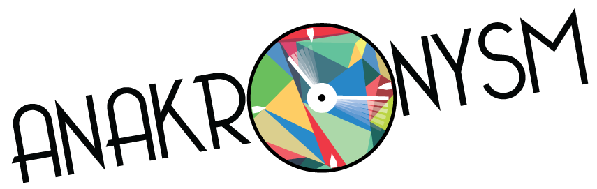

==========

## Projectionisme Interactif 

[http://miuqam.github.io/anakronysm/](http://miuqam.github.io/anakronysm/)

## Note
La librairie [leap-motion-processing](https://github.com/voidplus/leap-motion-processing) doit être installée dans le dossier Processing de l'utilisateur actuel.

### Utilisation

1. Copier les images du film dans le dossier Main selon la nomenclature suivante "Main####.png"
2. Réaliser les branchements de l'Arduino et de la Leap Motion selon la seciton "Plans"
3. Compiler et uplodader le fichier ```Arduino/manivelle/manivelle.ino``` sur l'Arduino.
4. Lancer le patch max Max/master.maxpat
5. Compiler et exécuter le sketch ```anakronysm.pde```.

### Matériel
- Arduino Leonardo
- Leap Motion
- Pas mal de bois.

### Plans
À venir.

### License
Ce projet est sous license MIT. Voir le fichier LICENSE pour plus de détails.

### Crédits
Pier Oliver Bourgault - programmation effets sonores
Marc-Antoine Brodeur - programmation effets visuels + arduino
Alexandre D'Avignon - direction artistique + identité visuelle + logo, rédacteur et recherchiste
Erwan d'Orgeville - programmation de la gestion des vidéos
Pierre-Luc Marrier - construction de l'installation + programmation effets sonores